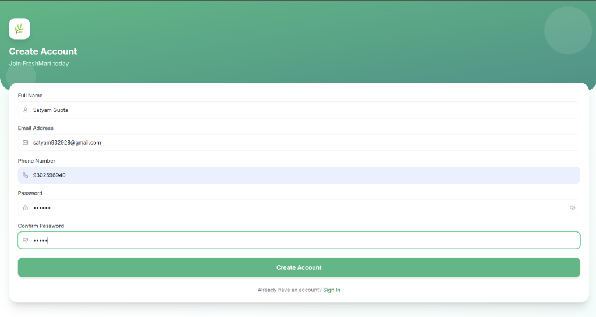
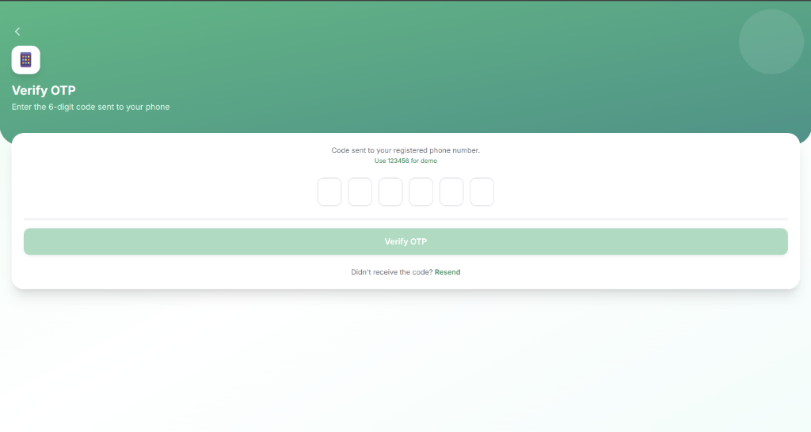
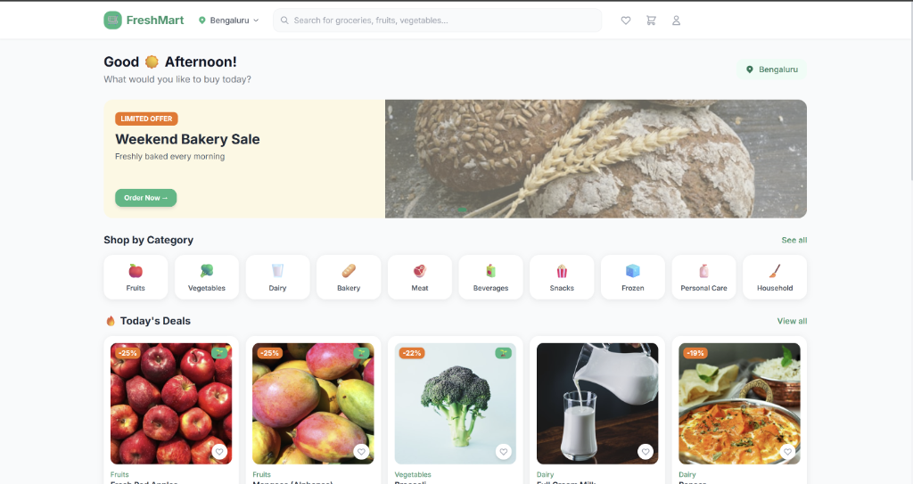
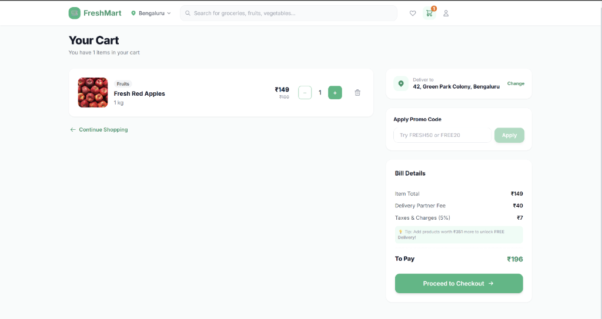
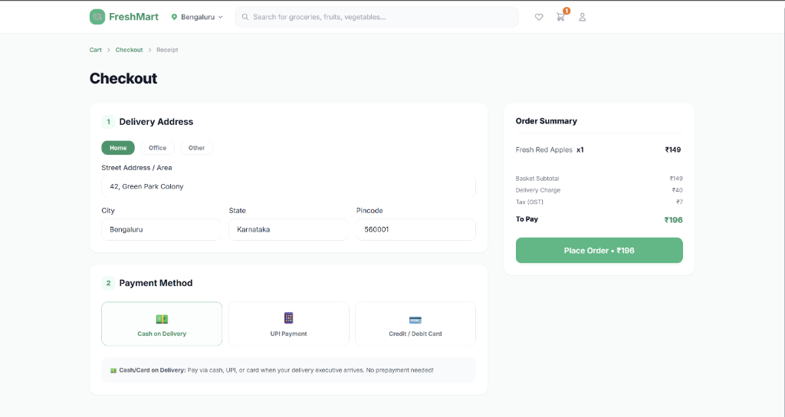
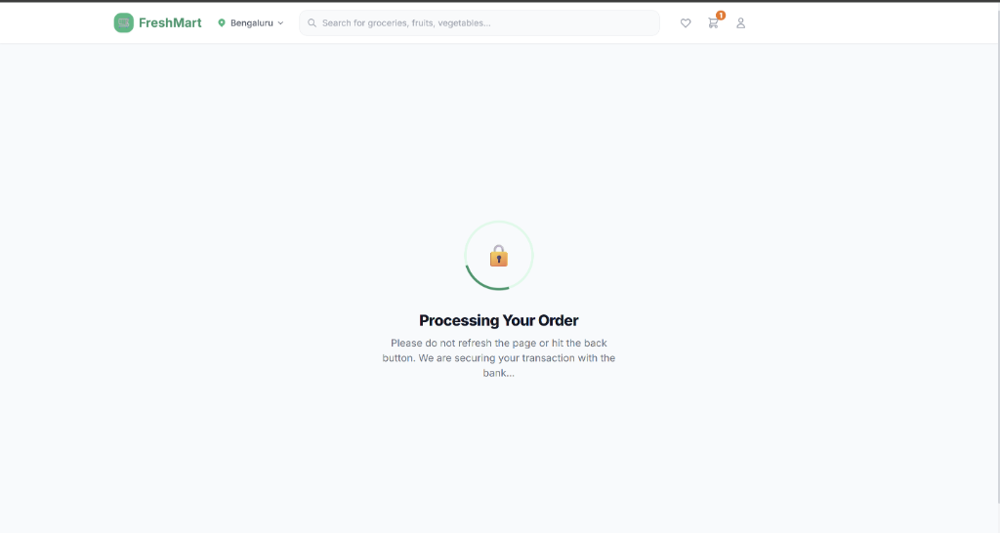

# FreshMart - Online Grocery Delivery Web Application

FreshMart is a modern mobile-first, fully responsive e-commerce grocery delivery web application built with React, TypeScript, Tailwind CSS, and Zustand. 

The application implements a complete user flow including a splash screen, onboarding walkthrough, location selector, home dashboard, real-time search query debouncing, category product listings, detailed product views with specs and reviews tabs, coupon code calculations, a checkout flow with address verification, and order logging.

---

## Application Preview

### Sign Up Page


### OTP Verification


### Home Dashboard


### Shopping Cart


### Checkout Page


### Secured Payment Processing


---

## Key Features

*   **Mobile-First Responsive Layout**: Carefully structured pages responsive down to 320px for mobile phones, scaling smoothly to wide-screen containers on desktop displays.
*   **Fully Simulated Authentication**:
    *   Animated splash screen with loaders and routing.
    *   3-slide onboarding component with interactive navigation controls.
    *   Login and sign up interfaces with front-end validation.
    *   6-digit OTP verification page with auto-focus inputs, paste support, and a demo bypass.
*   **Multi-City Finder**: Selection page featuring simulated automatic location detection, search filters, and suggested city selections.
*   **Shopping Cart System**:
    *   Product listing rows with itemized unit values, category tags, and increment controls.
    *   Free shipping status threshold indicator.
    *   Promo coupon system supporting codes like `FRESH50` (flat discount) and `FREE20` (percentage discount).
*   **Real-Time Search & Filters**: Live query input with a 300ms keystroke debounce, category filter tags, and sorting options (price, rating).
*   **Detailed Tabs View**: Dual-column product pages featuring details, specifications, and reviews tabs, along with related product recommendation widgets.
*   **Payment Checkout**: Shipping address details collector, payment method selector (UPI, Card, Cash on Delivery), and payment processing loaders.
*   **Customer Profile & History**: Displays user info, default address, and stores full transaction logs with custom status badges.

---

## Tech Stack & Configurations

*   **Core**: React 19, Vite, TypeScript (Strict Mode)
*   **State Management**: Zustand v5 (with local storage persistence)
*   **Routing**: React Router v7 (with nested layout shells)
*   **Styling**: Tailwind CSS v3 (Utility-first styling)

---

## Project Folder Structure

```
src/
├── types/           # TypeScript definitions (Categories, Orders, Filters)
├── data/            # Mock database (40+ Products, 10 Categories)
├── stores/          # Zustand stores (Auth, Cart, Favorites, Products, Locations, Orders, Toasts)
├── hooks/           # Reusable custom hooks (e.g. useDebounce)
├── components/
│   ├── layout/      # Shell wrappers (TopNav header, BottomNav footer)
│   ├── ui/          # Core atoms (Buttons, Inputs, QuantitySelectors, ToastContainers)
│   └── shared/      # Feature modules (ProductCard, CategoryCard, Skeletons, EmptyStates)
└── pages/           # View controllers (16 total views)
```

---

## Getting Started

### 1. Installation
Install the project dependencies using npm:
```bash
npm install
```

### 2. Run the Development Server
Launch the local development environment:
```bash
npm run dev
```
Open **[http://localhost:5173](http://localhost:5173)** in your browser to test the app.

### 3. Production Build
Compile and bundle the application:
```bash
npm run build
```

---

## Demo Bypass Credentials

This application runs on mock data. Use the credentials below to navigate the login and verification states:

*   **Demo OTP Code**: `123456`
*   **Mock Promo Coupon**: `FRESH50` or `FREE20`
